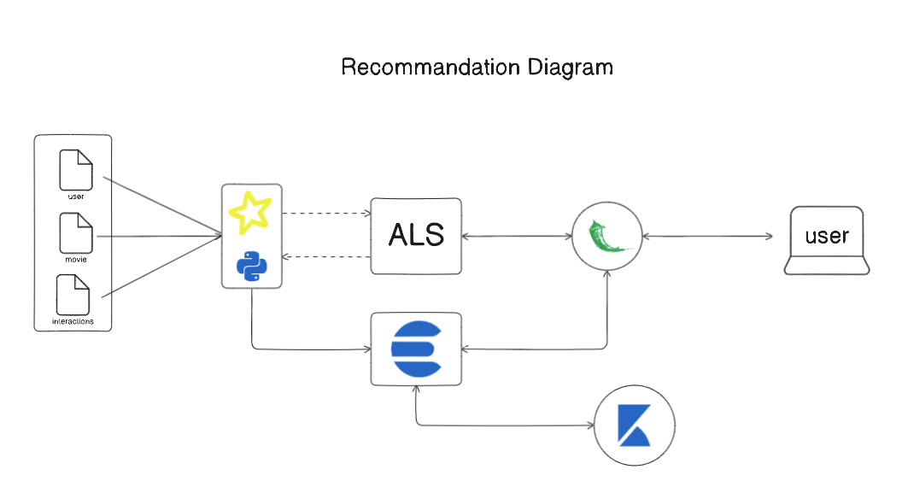

# Movielens-ALS-Recommendation

## Overview
Movielens-ALS-Recommendation is a project aimed at analyzing MovieLens data, capturing user interactions with movies. The goal is to extract meaningful insights for business decisions and implement a recommendation system based on collaborative filtering techniques.

## Workflow Diagram

## Project Description
The MovieLens dataset provides a rich source of information about user preferences for movies. This project utilizes collaborative filtering, a popular recommendation system technique, to identify patterns in user behavior and make personalized movie recommendations.

## Features
- **Data Analysis:** The project involves a thorough analysis of the MovieLens dataset to understand user-movie interactions and patterns.
  
- **Collaborative Filtering:** The recommendation system is built on collaborative filtering algorithms, leveraging user-item interactions to make personalized movie recommendations.
  
- **Insights for Business Decisions:** The analysis of MovieLens data aims to provide valuable insights that can inform strategic business decisions related to content, user engagement, and marketing.

## Workflows
1. **Business Intelligence (BI):**
   - Retrieve data from the source.
   - Perform data transformation and aggregation.
   - Insert data into Elasticsearch.
   - Analyze and visualize data using Kibana.

2. **Collaborative Filtering Model (CRIS-DP Approach with ALS Algorithm):**
   - **Business Understanding:**
     - Define the business objectives for the collaborative filtering model.
     - Identify the requirements and constraints.
   - **Data Understanding:**
     - Explore the MovieLens dataset to understand its structure and content.
     - Identify relevant features for building the recommendation model.
   - **Data Preparation:**
     - Preprocess the data, handling missing values and outliers.
     - Prepare the data for input into the collaborative filtering algorithm.
   - **Modeling:**
     - Implement the ALS algorithm for collaborative filtering.
     - Fine-tune model parameters for optimal performance.
   - **Evaluation:**
     - Assess the model's performance using appropriate metrics.
     - Validate the model against a test dataset.
   - **Deployment:**
     - Integrate the collaborative filtering model into the overall recommendation system.
     - Deploy the model for real-time recommendations.
   - **Monitoring and Maintenance:**
     - Implement monitoring tools to track model performance.
     - Regularly update the model based on new data.

## Technologies Used
- Python
- Spark
- Elasticsearch
- Kibana
